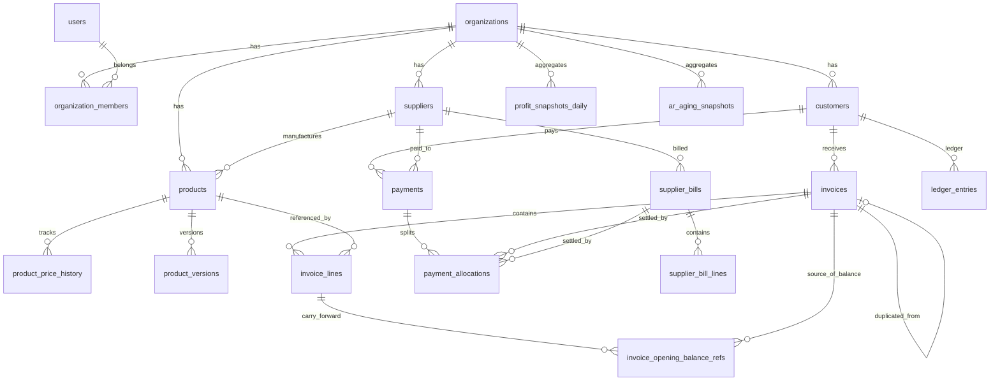

# PackFlow — Database relationships

## Entity relationship overview

## Table groups

| Group | Tables |
|-------|--------|
| Platform | `users`, `accounts`, `sessions` |
| Tenancy | `organizations`, `organization_members`, `organization_invites`, `subscriptions` |
| Parties | `customers`, `suppliers`, `bank_accounts` |
| Catalog | `products`, `product_versions`, `product_price_history` |
| Sales | `invoices`, `invoice_lines` |
| Payables | `supplier_bills`, `supplier_bill_lines` |
| Cash | `payments`, `payment_allocations` |
| Ledger | `ledger_entries` |
| Carry-forward | `invoice_opening_balance_refs` |
| Analytics | `profit_snapshots_daily`, `profit_snapshots_monthly`, `ar_aging_snapshots` |
| System | `audit_events`, `attachments`, `platform_backup_runs` |

## Foreign key summary

| Child table | Column | Parent | ON DELETE |
|-------------|--------|--------|-----------|
| `organization_members` | `organization_id` | `organizations` | CASCADE |
| `organization_members` | `user_id` | `users` | CASCADE |
| `organization_invites` | `organization_id` | `organizations` | CASCADE |
| `subscriptions` | `organization_id` | `organizations` | CASCADE |
| `suppliers` | `organization_id` | `organizations` | CASCADE |
| `customers` | `organization_id` | `organizations` | CASCADE |
| `products` | `organization_id` | `organizations` | CASCADE |
| `products` | `supplier_id` | `suppliers` | SET NULL |
| `product_versions` | `product_id` | `products` | CASCADE |
| `product_price_history` | `product_id` | `products` | CASCADE |
| `invoices` | `organization_id` | `organizations` | CASCADE |
| `invoices` | `customer_id` | `customers` | RESTRICT |
| `invoices` | `duplicated_from_invoice_id` | `invoices` | SET NULL |
| `invoice_lines` | `invoice_id` | `invoices` | CASCADE |
| `invoice_lines` | `product_id` | `products` | SET NULL |
| `payments` | `customer_id` | `customers` | RESTRICT |
| `payments` | `supplier_id` | `suppliers` | RESTRICT |
| `payment_allocations` | `payment_id` | `payments` | RESTRICT |
| `payment_allocations` | `invoice_id` | `invoices` | RESTRICT |
| `payment_allocations` | `supplier_bill_id` | `supplier_bills` | RESTRICT |
| `supplier_bills` | `supplier_id` | `suppliers` | RESTRICT |
| `ledger_entries` | `customer_id` | `customers` | RESTRICT |

## Cardinality rules

- One **organization** → many members, customers, suppliers, products, invoices.
- One **customer** → many invoices; invoice cannot exist without customer.
- One **product** → many price history rows; at most one “current” row per `(product, rate_type)` where `valid_to IS NULL`.
- One **invoice** → many lines; deleting draft invoice cascades lines.
- One **payment** → many allocations; sum(allocations) ≤ `payment.amount_cents`.
- One **invoice** → many allocations; sum(allocations toward invoice) ≤ `invoice.balance_due` at allocation time.

## Invoice lifecycle (data)

| Status | `invoice_number` | `issued_at` | `balance_due_cents` |
|--------|------------------|-------------|---------------------|
| `draft` | NULL | NULL | 0 or computed preview |
| `issued` | `INV-0001` | set | `grand_total_cents` |
| `partially_paid` | set | set | `grand_total - amount_paid` |
| `paid` | set | set | 0 |

## Profit (stored)

- **Line:** `line_profit_cents = (selling_rate_cents - purchase_rate_cents) * quantity` (rounded per app rules).
- **Invoice:** `total_profit_cents = SUM(line_profit_cents)` for product lines only.
- **Reports:** `profit_snapshots_daily` rolled up by date / customer / product.

## Multi-tenancy

Every tenant table includes `organization_id` with FK to `organizations`. All queries must filter by `organization_id`. Optional RLS policies commented in `schema.sql`.

## Backup

Daily backups are **infrastructure-level** (Neon/Supabase/RDS); not stored in this schema. See deployment runbook when implemented.
