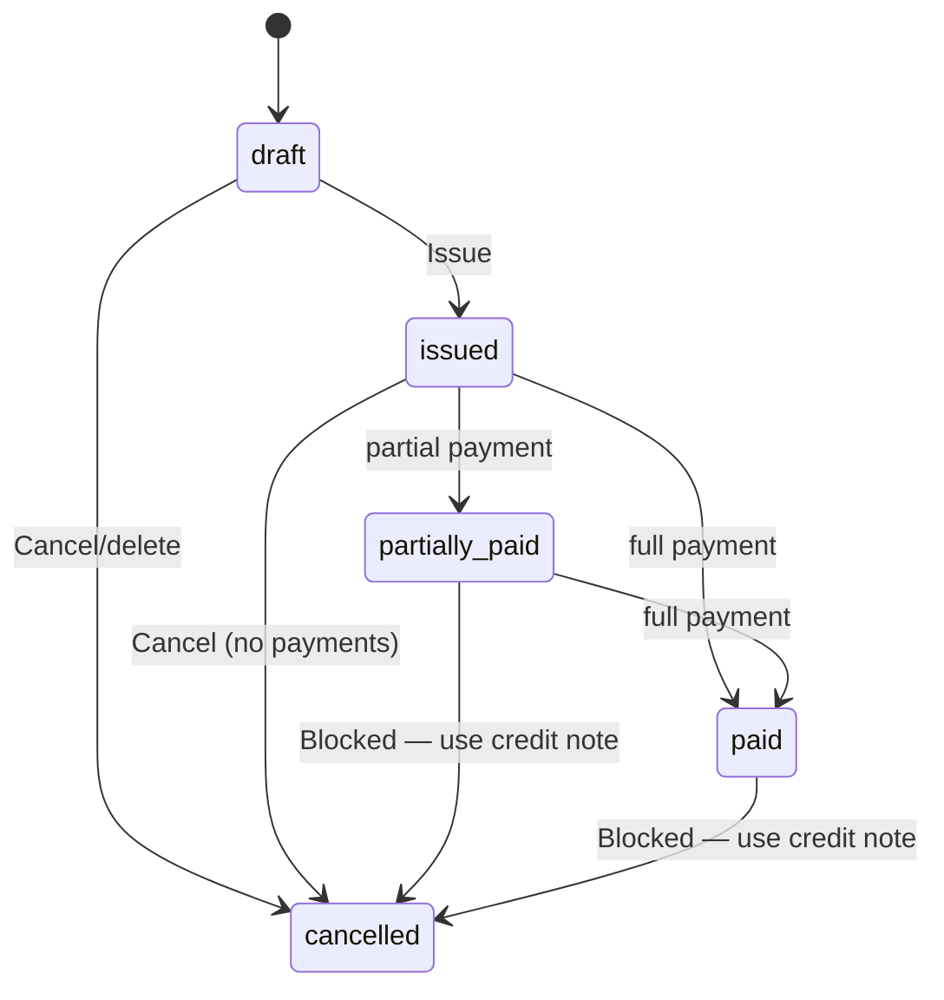

# PackFlow — Application Screen Architecture

Multi-tenant SaaS for packaging box brokers. Routes use org slug: `/{orgSlug}/...` unless noted.

**Version 2.1** — includes supplier ledger, global search, production checklist v3.0. See [`PRODUCTION_READINESS.md`](./PRODUCTION_READINESS.md) · [`ARCHITECTURE_INDEX.md`](./ARCHITECTURE_INDEX.md).

**Roles:** Owner · Admin · Staff · Viewer (actions marked with required role where restricted)

---

## Global patterns

### App shells

| Shell | Used on | Structure |
|-------|---------|-----------|
| **Marketing** | Landing, auth | Top nav + full-width content, no sidebar |
| **Auth** | Login, signup, invite | Centered card, minimal chrome |
| **App** | All authenticated org routes | Sidebar (desktop) / bottom nav (mobile) + top bar + main |

### Top bar (app shell)

- Org name + switcher (future)
- **⌘K Command palette** — global navigate / search / quick actions
- **Notifications bell** — unread count → drawer or `/notifications`
- **+ New Invoice** primary CTA (Staff+)
- User menu: profile, settings, sign out

### Command palette (`Cmd+K` / `Ctrl+K`)

| Category | Examples |
|----------|----------|
| Navigate | Dashboard, Invoices, Clients, Products, Payments, Analytics, Settings |
| Create | New invoice, Record payment, Add client, Add product |
| Search | Client name/phone, Product name/L×W×H/GSM, Invoice `INV-####` |
| Recent | Open last 5 drafts / invoices |

Role-filtered: Viewer sees search/nav only, no create actions.

### Global search (dedicated page — phase 2)

| | |
|--|--|
| **Route** | `/{orgSlug}/search?q=` |
| **Purpose** | Full results when query is too large for palette; grouped hits with “show more”. |
| **Layout** | App shell — search input + tabbed result groups. |

**Components:** `GlobalSearchInput`, `SearchResultsGroup` (Clients, Products, Invoices, Suppliers), empty state, recent searches.

**Actions:** Click result → entity detail; palette link “See all results” opens this route.

**Mobile:** Full-width input; results as cards per group.

**MVP:** Command palette (above) is sufficient; this page is optional.

### Sidebar / bottom nav (app)

| Nav item | Route | Icon priority mobile |
|----------|-------|----------------------|
| Dashboard | `/{orgSlug}` | ✓ |
| Invoices | `/{orgSlug}/invoices` | ✓ |
| Clients | `/{orgSlug}/clients` | — |
| Products | `/{orgSlug}/products` | — |
| Payments | `/{orgSlug}/payments` | ✓ |
| More ▾ | Credit notes, suppliers, analytics, import, settings | Hamburger / More tab |

**Viewer:** nav visible; destructive/create actions hidden.

---

## 1. Landing page

| | |
|--|--|
| **Route** | `/` |
| **Purpose** | Acquire brokers; explain value (fast invoicing, margin tracking, Indian PDFs, outstanding control). |
| **Layout** | Marketing shell. Hero → features → pricing teaser → CTA → footer. |

### Components

- `MarketingHeader` — logo, Login, Start free trial
- `HeroSection` — headline, subcopy, primary CTA → `/signup`
- `FeatureGrid` — invoice in 30s, profit, ledger, PDF
- `ScreenshotCarousel` — invoice builder + dashboard mockups
- `PricingTeaser` — link to pricing (phase 2)
- `MarketingFooter` — legal, contact

### Actions

| Action | Target |
|--------|--------|
| Start free trial | `/signup` |
| Login | `/login` |
| View features | `#features` anchor |

### Mobile behavior

- Single column; sticky bottom CTA bar optional
- Hamburger for footer links
- Hero CTA full-width

---

## 2. Authentication pages

### 2a. Login

| | |
|--|--|
| **Route** | `/login` |
| **Purpose** | Existing users sign in. |
| **Layout** | Auth shell — centered card (max-w-md). |

**Components:** Logo, email, password, Remember me, Forgot password, Submit, link to Signup, OAuth buttons (if enabled).

**Actions:** Submit → session → redirect to last org or org picker or onboarding.

**Mobile:** Full-width card, large inputs, keyboard-safe submit above fold.

---

### 2b. Signup

| | |
|--|--|
| **Route** | `/signup` |
| **Purpose** | New broker registration + org creation. |
| **Layout** | Auth shell — stepped or single card. |

**Components:** Name, email, password, org/business name, slug preview, terms checkbox, Submit.

**Actions:** Create user + org (owner) → `/{orgSlug}/settings/org` onboarding or dashboard.

**Mobile:** Same as login; slug field shows `packflow.app/{slug}` helper text.

---

### 2c. Forgot password

| | |
|--|--|
| **Route** | `/forgot-password` |
| **Purpose** | Password reset email. |
| **Layout** | Auth card. |

**Components:** Email input, Send link, Back to login.

**Mobile:** Standard auth card.

---

### 2d. Accept invite

| | |
|--|--|
| **Route** | `/invite/[token]` |
| **Purpose** | Join org via invite (role preset). |
| **Layout** | Auth card with org name banner. |

**Components:** Org name, role badge, name/password (if new user), Accept.

**Actions:** Accept → `/{orgSlug}`.

**Mobile:** Full-width card.

---

### 2e. Org picker (optional)

| | |
|--|--|
| **Route** | `/organizations` |
| **Purpose** | User belongs to multiple orgs. |
| **Layout** | Simple list cards. |

**Mobile:** Full-width list tiles.

---

## 3. Dashboard

| | |
|--|--|
| **Route** | `/{orgSlug}` |
| **Purpose** | At-a-glance sales, receivables, profit, top clients/products. |
| **Layout** | App shell — responsive grid of KPI cards + tables. |

### Components

- `KpiCard` × 4 — Today's sales · MTD sales · Total outstanding · Overdue outstanding
- `ProfitSummaryCard` — MTD margin (box profit), link to Analytics
- `TopDebtorsTable` — Top 10 clients by outstanding (name, amount, days overdue)
- `TopClientsChart` — MTD revenue (bar/table toggle)
- `TopProductsTable` — MTD qty / revenue
- `QuickActions` — New Invoice, Record Payment, Add Client
- `RecentInvoicesList` — last 5 issued (number, client, amount, status)

### Actions

| Action | Role | Navigation |
|--------|------|------------|
| + New Invoice | Staff+ | `/{orgSlug}/invoices/new` |
| Record Payment | Staff+ | `/{orgSlug}/payments/new` |
| View debtor | All | `/{orgSlug}/clients/[id]/ledger` |
| View all outstanding | All | `/{orgSlug}/analytics?tab=receivables` |
| Open invoice | All | `/{orgSlug}/invoices/[id]` |

### Mobile behavior

- 2-column KPI grid → single column stack
- Top debtors as swipeable cards (not wide table)
- Sticky FAB: **+ Invoice**
- Collapse charts to tables for readability

---

## 4. Invoice Builder

| | |
|--|--|
| **Route** | `/{orgSlug}/invoices/new` (also edit draft: `/{orgSlug}/invoices/[id]/edit`) |
| **Purpose** | Create/issue invoice in &lt;30s; inline client/product; charges; carry-forward. |
| **Layout** | App shell with **minimal chrome** — full-height builder, sticky footer total bar. |

### Components

- `ClientSelector` — search combobox + **[+ New Client]** sheet
- `InvoiceMetaBar` — date, due date (optional)
- `GstPanel` (collapsible) — enable GST, place of supply, per-line HSN/tax %; shows **tax summary** preview (taxable, CGST, SGST, IGST, round-off) — **off by default (MVP)**
- `ProductLinePicker` — search (name, L, W, H, GSM) + **[+ New Box]** sheet
- `InvoiceLineList` — editable rows: product lines + charge rows
- `AddChargeButtons` — Transport · Loading/Unloading · Custom
- `OpeningBalanceToggle` — checkbox + read-only system amount + optional edit
- `TotalsPanel` — subtotals, opening balance, grand total (live)
- `StickyActionBar` — Save Draft · Issue & PDF
- **Sheets (modals):** `QuickClientForm`, `QuickProductForm`, `CustomChargeForm`

### Invoice line row (product)

- Box name, L×W×H, ply, GSM (read-only snapshot after pick)
- Qty (stepper), selling rate (editable), line amount, remove

### Invoice line row (charge)

- Label, amount, remove

### Actions

| Action | Role | Result |
|--------|------|--------|
| Select / create client | Staff+ | Sets `customer_id` |
| Add product from search | Staff+ | New line from catalog |
| Quick-add product | Staff+ | Creates product + line (`invoice_builder`) |
| Quick-add client | Staff+ | Creates client + selects |
| Add transport / loading / custom | Staff+ | Charge line |
| Include previous balance | Staff+ | `opening_balance` line + refs |
| Save draft | Staff+ | `status=draft`, stay on page |
| Issue | Staff+ | `INV-####`, PDF, → detail or share sheet |
| Duplicate from… | Staff+ | Pre-fill from picker (separate entry from list) |

### Mobile behavior (critical)

- **Single column**; client search full width first
- Product search opens **full-screen sheet** with keyboard focus
- Line items as **cards** (not table): qty/rate large touch targets (≥44px)
- **Sticky bottom bar:** Grand total + Save / Issue (primary)
- Quick-add forms = **bottom sheets** (90vh), not new routes
- Issue success → bottom sheet: Download PDF · Share · View invoice
- Autosave draft every N seconds (UX note for implementation)

---

## 5. Invoice List

| | |
|--|--|
| **Route** | `/{orgSlug}/invoices` |
| **Purpose** | Find, filter, and open invoices; duplicate; record payment. |
| **Layout** | App shell — filters bar + data table / card list. |

### Components

- `PageHeader` — title, **+ New Invoice**
- `InvoiceFilters` — status tabs (All · Draft · Issued · Partial · Paid · **Cancelled**), date range, client search
- `InvoiceDataTable` / `InvoiceCardList` — number, client, date, total, balance, status badge
- `RowActionsMenu` — View · Edit (draft) · Duplicate · Record payment · PDF

### Actions

| Action | Role | Target |
|--------|------|--------|
| New invoice | Staff+ | `/invoices/new` |
| Open | All | `/invoices/[id]` |
| Edit draft | Staff+ | `/invoices/[id]/edit` |
| Duplicate | Staff+ | new draft pre-filled |
| Record payment | Staff+ | `/payments/new?invoiceId=` |
| Download PDF | All | file download |

### Mobile behavior

- Cards replace table: invoice #, client, amount, status chip
- Filters in horizontal scroll chips
- Swipe row: Payment · PDF (optional)
- FAB: New Invoice

---

### 5a. Invoice detail (sub-screen)

| | |
|--|--|
| **Route** | `/{orgSlug}/invoices/[id]` |
| **Purpose** | View issued invoice, PDF, payments, profit, duplicate. |
| **Layout** | App shell — summary header + line table + payment history sidebar (desktop). |

**Components:** Status badge (incl. **Cancelled**), client link, totals, **GstTaxSummary** (if enabled), line table, profit summary, allocation list, PDF preview/download, QR thumb, **Files** tab (attachments), link to credit notes, audit snippet (Admin+).

**Actions:**

| Action | Role | When |
|--------|------|------|
| Issue | Staff+ | `draft` |
| Record payment | Staff+ | issued / partial |
| Duplicate | Staff+ | not draft |
| Download / Regenerate PDF | All / Admin+ | issued+ |
| **Cancel invoice** | Admin+ | issued, **zero payments** |
| **Create credit note** | Admin+ | issued / partial / paid |
| Share public link | Staff+ | issued+ |

**Mobile:** Stacked sections; PDF in native viewer; destructive actions in overflow menu.

---

## 6. Client Management

### 6a. Client list

| | |
|--|--|
| **Route** | `/{orgSlug}/clients` |
| **Purpose** | Browse clients, outstanding balance, quick navigation. |
| **Layout** | App shell — search + table/cards. |

**Components:** Search, **+ Add Client**, table (name, phone, outstanding, last invoice), sort by outstanding.

**Actions:** Add → `/clients/new` · Open → `/clients/[id]` · Ledger → `/clients/[id]/ledger`

**Mobile:** Card list; tap → detail; outstanding as bold secondary line.

---

### 6b. Client create / edit

| | |
|--|--|
| **Route** | `/{orgSlug}/clients/new` · `/{orgSlug}/clients/[id]/edit` |
| **Purpose** | Full client profile (more than quick-add on invoice). |
| **Layout** | Form page, two-column desktop / single mobile. |

**Components:** Name, phone, email, address, GSTIN (optional), payment terms, credit limit, notes, active toggle.

**Actions:** Save · Cancel · Delete (Admin+, if no blocking invoices).

**Mobile:** Single column form; save sticky bottom.

---

### 6c. Client detail

| | |
|--|--|
| **Route** | `/{orgSlug}/clients/[id]` |
| **Purpose** | Client hub: summary, recent invoices, actions. |
| **Layout** | Header + tabs: Overview · Invoices · Ledger. |

**Components:** Outstanding banner, contact card, recent invoices table, quick actions.

**Actions:** New invoice (pre-selected client), Record payment, View ledger, Edit.

**Mobile:** Tabs as segmented control; outstanding banner pinned under header.

---

## 7. Supplier Management

### 7a. Supplier list

| | |
|--|--|
| **Route** | `/{orgSlug}/suppliers` |
| **Purpose** | Manage manufacturers; link to products and AP. |
| **Layout** | App shell — table + search. |

**Components:** Search, **+ Add Supplier**, table (name, phone, # products, balance due).

**Actions:** Add · Open detail · **Ledger** → `/suppliers/[id]/ledger` · Record supplier payment.

**Mobile:** Card list; swipe or menu → Ledger · Pay.

---

### 7b. Supplier create / edit

| | |
|--|--|
| **Route** | `/{orgSlug}/suppliers/new` · `/{orgSlug}/suppliers/[id]/edit` |
| **Purpose** | Manufacturer master data. |
| **Layout** | Form page. |

**Components:** Name, contact, address, GSTIN, payment terms, notes, active.

**Mobile:** Single column; sticky save.

---

### 7c. Supplier detail

| | |
|--|--|
| **Route** | `/{orgSlug}/suppliers/[id]` |
| **Purpose** | Supplier hub + products using this manufacturer. |
| **Layout** | Header + tabs: Overview · Products · Bills · Ledger. |

**Components:** Contact card, linked products list, bills summary, outstanding payable summary, pay supplier CTA.

**Actions:** Add bill (phase 2) · Record supplier payment → `/payments/supplier/new?supplierId=` · **View ledger** → `/suppliers/[id]/ledger`

**Mobile:** Tabs; **Ledger** tab opens full ledger route; products as compact list.

---

### 7d. Supplier ledger

| | |
|--|--|
| **Route** | `/{orgSlug}/suppliers/[id]/ledger` |
| **Purpose** | Supplier account statement and **payable balance** — all bills, payments, and credits in one chronological view. |
| **Layout** | App shell — supplier summary header + filters + ledger table (desktop) / card list (mobile). |

#### Supplier summary (header)

- Supplier name, phone, GSTIN (if set)
- **Outstanding payable** — sum of open `supplier_bills.balance_due_cents` (large, primary KPI)
- Optional: open bill count, last payment date
- Link back to `/{orgSlug}/suppliers/[id]`

#### Ledger columns (desktop)

| Column | Content |
|--------|---------|
| **Date** | Transaction date (`bill_date`, `payment_date`, etc.) |
| **Type** | `Bill` · `Payment` · `Credit` |
| **Reference** | Bill #, payment ref, credit note # (e.g. `BILL-0001`, `PAY-…`, `SCN-…`) |
| **Debit** | Amount that **reduces** payable (payments, supplier credits) |
| **Credit** | Amount that **increases** payable (bills) |
| **Balance** | **Running balance** (payable owed to supplier after each row) |

**Balance convention (accounts payable):**

- **Bill** → amount in **Credit** column (payable increases)
- **Payment** → amount in **Debit** column (payable decreases)
- **Credit** (supplier credit note / debit note) → amount in **Debit** column (payable decreases)

Data source: `ledger_entries` where `supplier_id` matches; `entry_type` ∈ `supplier_bill`, `supplier_payment`, and future supplier credit types. Fallback join to `supplier_bills` and outbound `payments` if ledger row missing during migration.

#### Components

- `SupplierLedgerHeader` — summary + outstanding payable
- `DateRangeFilter` — preset (This month / Last month / FY / Custom) + from/to
- `SupplierLedgerTable` — columns above + row click → drill-down
- `LedgerSummaryFooter` — total debits, total credits, **closing balance**
- `ExportCsvButton` — **phase 2** (same filters as on-screen)

#### Actions

| Action | Role | Target |
|--------|------|--------|
| Record supplier payment | Staff+ | `/{orgSlug}/payments/supplier/new?supplierId=` |
| View supplier bill | All | `/{orgSlug}/supplier-bills/[id]` (when bill exists) |
| Drill into transaction | All | Bill → supplier bill detail · Payment → `/{orgSlug}/payments/[id]` · Credit → credit/adjustment detail (phase 2) |
| Add supplier bill | Admin+ | `/{orgSlug}/supplier-bills/new?supplierId=` (phase 2) |
| Edit supplier | Admin+ | `/{orgSlug}/suppliers/[id]/edit` |

#### Mobile behavior

- **Card-based ledger entries** — each row: date, type chip, reference, debit/credit amounts, running balance
- **Outstanding payable** pinned under supplier name (sticky sub-header)
- **Sticky bottom bar:** primary **Record payment** (full width)
- Date filters in collapsible sheet
- No horizontal-scroll table; tap card → transaction detail
- Pull-to-refresh on ledger list

#### Access from

- Supplier detail → **Ledger** tab (navigates to this route)
- Supplier list row action → **Ledger**
- Command palette → “Open supplier ledger” (when supplier context selected)

---

## 8. Product Management

### 8a. Product list

| | |
|--|--|
| **Route** | `/{orgSlug}/products` |
| **Purpose** | Catalog of boxes; search by name/dimensions/GSM. |
| **Layout** | App shell — search + filters (active/inactive) + table. |

**Components:** `ProductSearch` (name, L, W, H, GSM), status filter, table (name, dimensions, ply, GSM, purchase, sell, manufacturer, status).

**Actions:** Add product · Open detail · Deactivate.

**Mobile:** Card per product with dimensions subtitle; search sticky top.

---

### 8b. Product create / edit

| | |
|--|--|
| **Route** | `/{orgSlug}/products/new` · `/{orgSlug}/products/[id]/edit` |
| **Purpose** | Full product master (same fields as quick-add). |
| **Layout** | Form sections: Identity · Spec · Rates · Manufacturer · GST (optional). |

**Components:** Name, L/W/H, ply, GSM, supplier select (+ quick add manufacturer), purchase rate, selling rate, HSN (optional), status.

**Actions:** Save (writes price history on rate change) · Cancel.

**Mobile:** Section accordions; numeric inputs with unit labels.

---

### 8c. Product detail

| | |
|--|--|
| **Route** | `/{orgSlug}/products/[id]` |
| **Purpose** | View spec, margin, price history, usage. |
| **Layout** | Header + tabs: Overview · Price History · Invoices. |

**Components:** Spec card, current rates, margin calc, `PriceHistoryTable` (purchase/selling timelines), recent invoice lines.

**Actions:** Edit · Deactivate · New invoice with product pre-added (phase 2).

**Mobile:** Price history as vertical timeline.

---

## 9. Payments

### 9a. Payment list

| | |
|--|--|
| **Route** | `/{orgSlug}/payments` |
| **Purpose** | All inbound client payments; filter and reconcile. |
| **Layout** | App shell — tabs Inbound / Outbound (supplier). |

**Components:** Date filter, client filter, table (date, party, amount, allocated, unallocated, reference).

**Actions:** **+ Record Payment** · Open allocation detail.

**Mobile:** Card list; segmented Inbound/Outbound.

---

### 9b. Record payment (client)

| | |
|--|--|
| **Route** | `/{orgSlug}/payments/new` (?`customerId`, ?`invoiceId`) |
| **Purpose** | Record receipt; allocate to one or many invoices (partial OK). |
| **Layout** | Form + allocation panel. |

**Components:** Client selector, amount, date, method (UPI/bank/cash/cheque), reference, notes, `OpenInvoicesChecklist` (FIFO suggest), allocation sum validator.

**Actions:** Save → updates invoice `partially_paid` / `paid` · Unallocated remainder stays on-account.

**Mobile:** Client first; invoice checklist as expandable cards with amount inputs; sticky Save.

---

### 9c. Supplier payment

| | |
|--|--|
| **Route** | `/{orgSlug}/payments/supplier/new` |
| **Purpose** | Pay manufacturer; allocate to supplier bills. |
| **Layout** | Same as client payment with supplier party. |

**Mobile:** Same pattern as client payment.

---

### 9d. Payment detail

| | |
|--|--|
| **Route** | `/{orgSlug}/payments/[id]` |
| **Purpose** | View payment and allocations. |

**Mobile:** Read-only summary + linked invoices list.

---

## 10. Client Ledger

> **Supplier counterpart:** payable statement at `/{orgSlug}/suppliers/[id]/ledger` — see [§7d Supplier ledger](#7d-supplier-ledger).

| | |
|--|--|
| **Route** | `/{orgSlug}/clients/[id]/ledger` |
| **Purpose** | Running statement: all invoices, payments, opening balance, outstanding. |
| **Layout** | App shell — client header + chronological ledger table. |

### Components

- `ClientLedgerHeader` — name, phone, **current outstanding** (large)
- `DateRangeFilter`
- `LedgerTable` — date, type, reference (INV-####), debit, credit, **running balance**
- `ExportCsvButton` (phase 2)
- Summary row: total debits, credits, closing balance

### Actions

| Action | Role | Target |
|--------|------|--------|
| New invoice | Staff+ | `/invoices/new?customerId=` |
| Record payment | Staff+ | `/payments/new?customerId=` |
| Open invoice | All | invoice detail |
| Open payment | All | payment detail |

### Mobile behavior

- Outstanding pinned header
- Ledger as **card timeline** (date, description, +/- amount, balance)
- Infinite scroll by month
- No horizontal scroll table

---

## 11. Analytics

| | |
|--|--|
| **Route** | `/{orgSlug}/analytics` |
| **Purpose** | Profit (invoice/client/product/month/year/lifetime), sales, receivables. |
| **Layout** | App shell — tabbed report hub. |

### Tabs

| Tab | Route query | Content |
|-----|-------------|---------|
| Profit | `?tab=profit` | MTD/QTD/YTD/lifetime margin charts, by client/product tables |
| Sales | `?tab=sales` | Daily/monthly revenue (excludes opening balance line) |
| Receivables | `?tab=receivables` | Total/overdue outstanding, aging buckets, top debtors |
| Products | `?tab=products` | Top products by profit/qty |

### Components

- `PeriodSelector` — today / month / quarter / year / custom
- `ProfitChart` — bar/line from `profit_snapshots_*`
- `ProfitByClientTable` · `ProfitByProductTable`
- `ArAgingChart` — 0-30-60-90+
- `SalesKpiRow`

### Actions

- Drill down client → client detail
- Drill down product → product detail
- Export (phase 2)

### Mobile behavior

- Tabs = horizontal scroll
- Charts simplified to KPI + table
- Receivables tab mirrors dashboard debtors with “View all”

---

## 12. Settings

Settings use sub-routes under `/{orgSlug}/settings`.

### 12a. Organization

| | |
|--|--|
| **Route** | `/{orgSlug}/settings/org` |
| **Purpose** | Legal identity, logo, address, GSTIN, invoice defaults. |
| **Layout** | Settings sidebar + form sections. |

**Components:** Business name, legal name, logo upload, address, state/code, GSTIN/PAN, default GST toggle, invoice prefix (read-only seq), payment terms default, bank/UPI for PDF.

**Actions:** Save (Owner/Admin).

**Mobile:** Settings as vertical nav list instead of sidebar.

---

### 12b. Invoice & PDF

| | |
|--|--|
| **Route** | `/{orgSlug}/settings/invoice` |
| **Purpose** | Full PDF customization for Indian tax invoice output. |

**Components:**

| Component | Purpose |
|-----------|---------|
| `LogoUpload` | Company logo on PDF |
| `SignatureUpload` | Authorized signature image |
| `SignatoryNameField` | Printed name under signature |
| `BankAccountsList` | Account no., IFSC, branch (from `bank_accounts`) |
| `UpiQrField` | UPI ID for QR payload |
| `TermsEditor` | Terms & conditions footer |
| `PdfDisplayToggles` | Show logo / signature / QR / bank details |
| `GstDefaultsSection` | Default GST on new invoices, default interstate behavior |
| `PdfPreviewButton` | Sample Indian-format PDF |

**Mobile:** Preview full-screen; uploads via camera/gallery for signature.

---

### 12c. Team

| | |
|--|--|
| **Route** | `/{orgSlug}/settings/team` |
| **Purpose** | Members, invites, roles. |
| **Layout** | Member table + invite form. |

**Components:** Member list (name, email, role), Invite by email + role select, pending invites, Remove/change role.

**Actions:** Invite (Owner/Admin) · Change role · Remove member.

**Mobile:** Member cards with role dropdown sheet.

---

### 12d. Billing (PackFlow subscription)

| | |
|--|--|
| **Route** | `/{orgSlug}/settings/billing` |
| **Purpose** | SaaS plan, Stripe portal. |
| **Role** | Owner only |

**Mobile:** Simple plan card + manage subscription link.

---

### 12e. Profile

| | |
|--|--|
| **Route** | `/{orgSlug}/settings/profile` |
| **Purpose** | Current user name, email, password. |

**Mobile:** Standard form.

---

### 12f. Backup & security

| | |
|--|--|
| **Route** | `/{orgSlug}/settings/security` |
| **Purpose** | Backup status, tenant data export, restore policy. |
| **Role** | Admin+ read; **Owner** for export |

**Components:** `BackupRunsTable` (from `platform_backup_runs`), last success/fail, RPO/RTO info card, **Export organization data** (creates `organization_export_jobs`), restore runbook link (support — no self-serve PITR in MVP).

**Mobile:** Stacked info cards.

---

### 12g. Audit log

| | |
|--|--|
| **Route** | `/{orgSlug}/settings/audit-log` |
| **Purpose** | Immutable activity trail for compliance and dispute resolution. |
| **Role** | Admin+ |

**Components:** Filters (date, user, entity, action), `AuditEventTable`, `JsonDiffViewer` (before/after).

**Actions:** Export CSV (phase 2).

**Mobile:** Filter sheet + event cards.

---

### 12h. Data import

| | |
|--|--|
| **Route** | `/{orgSlug}/settings/import` |
| **Purpose** | Bulk onboard clients and products via CSV. |
| **Role** | Admin+ |

**Sub-routes:**

| Route | Purpose |
|-------|---------|
| `.../import` | Hub — choose Clients or Products, download templates |
| `.../import/clients` | Upload → column mapping → preview → run `import_jobs` |
| `.../import/products` | Same for products |
| `.../import/[jobId]` | Results, success/fail counts, error report download |

**Mobile:** Upload from files app; preview as scrollable table.

---

### 12i. Notification preferences

| | |
|--|--|
| **Route** | `/{orgSlug}/settings/notifications` |
| **Purpose** | Configure due/overdue/digest/low-collection alerts. |
| **Role** | Admin+ |

**Components:** Toggle per `notification_type`, days-before-due input, email vs in-app channel, collection threshold %.

---

### 12j. Attachments (org assets)

| | |
|--|--|
| **Route** | `/{orgSlug}/settings/attachments` |
| **Purpose** | Manage logo, signature, and other org-level files. |
| **Role** | Admin+ |

**Components:** File list by kind, upload/replace, preview, delete.

---

## 13. Credit notes

### 13a. Credit note list

| | |
|--|--|
| **Route** | `/{orgSlug}/credit-notes` |
| **Purpose** | List all credit notes (CN-0001…). |
| **Layout** | App shell — filters + table. |

**Components:** Status tabs (Draft · Issued · Applied), client filter, table (CN #, client, original INV, amount, balance).

**Actions:** New (from invoice picker) · Open detail · PDF.

**Mobile:** Card list.

---

### 13b. Create credit note

| | |
|--|--|
| **Route** | `/{orgSlug}/credit-notes/new?invoiceId=` |
| **Purpose** | Issue CN against an existing invoice (full or partial reversal). |
| **Layout** | Form similar to invoice builder (simplified). |

**Components:** Original invoice summary (read-only), reason (required), line picker (mirror invoice lines), GST block if original had GST, totals, Issue CN.

**Actions:** Save draft · Issue CN-#### · Generate PDF.

**Mobile:** Single column; sticky Issue.

---

### 13c. Credit note detail

| | |
|--|--|
| **Route** | `/{orgSlug}/credit-notes/[id]` |
| **Purpose** | View CN, PDF, apply balance to invoices. |

**Components:** Status, lines, tax summary, `ApplyToInvoices` allocation UI, PDF download.

**Actions:** Apply to open invoices · Download PDF · **Download CN PDF** (Indian format, GST block when enabled).

**Components (PDF):** Same template family as invoice — logo, signature, QR, bank, terms, tax summary.

---

## 14. Notifications inbox

| | |
|--|--|
| **Route** | `/{orgSlug}/notifications` |
| **Purpose** | In-app notification history. |

**Components:** Unread/read tabs, list (title, body, time), entity deep links (invoice, client).

**Actions:** Mark read · Mark all read.

**Mobile:** Full-screen list from bell icon.

---

## Invoice status model (reference)



**Cancelled:** excluded from sales/profit dashboards; still visible in audit and ledger with reversing entries if needed.

---

## Public / unauthenticated screens

### Public invoice view

| | |
|--|--|
| **Route** | `/i/[publicToken]` |
| **Purpose** | Client views invoice + PDF without login. |
| **Layout** | Minimal chrome — org logo, invoice summary, Download PDF, Pay via UPI (QR). |

**Mobile:** Full-width PDF link; QR centered.

---

## Route map (complete)

```
/                           Landing
/login                      Login
/signup                     Signup
/forgot-password            Forgot password
/invite/[token]             Accept invite
/organizations              Org picker (optional)

/i/[publicToken]            Public invoice

/{orgSlug}                  Dashboard
/{orgSlug}/invoices         Invoice list
/{orgSlug}/invoices/new     Invoice builder (create)
/{orgSlug}/invoices/[id]    Invoice detail
/{orgSlug}/invoices/[id]/edit  Invoice builder (draft edit)

/{orgSlug}/clients          Client list
/{orgSlug}/clients/new      Client create
/{orgSlug}/clients/[id]     Client detail
/{orgSlug}/clients/[id]/edit
/{orgSlug}/clients/[id]/ledger  Client ledger

/{orgSlug}/suppliers        Supplier list
/{orgSlug}/suppliers/new
/{orgSlug}/suppliers/[id]
/{orgSlug}/suppliers/[id]/edit
/{orgSlug}/suppliers/[id]/ledger  Supplier ledger (AP statement)

/{orgSlug}/supplier-bills/[id]    Supplier bill detail (drill from ledger)
/{orgSlug}/supplier-bills/new     New bill (phase 2)

/{orgSlug}/products         Product list
/{orgSlug}/products/new
/{orgSlug}/products/[id]
/{orgSlug}/products/[id]/edit

/{orgSlug}/payments         Payment list
/{orgSlug}/payments/new     Client payment
/{orgSlug}/payments/supplier/new
/{orgSlug}/payments/[id]

/{orgSlug}/analytics        Analytics hub

/{orgSlug}/settings/org
/{orgSlug}/settings/invoice
/{orgSlug}/settings/team
/{orgSlug}/settings/billing
/{orgSlug}/settings/profile
/{orgSlug}/settings/security
/{orgSlug}/settings/audit-log
/{orgSlug}/settings/import
/{orgSlug}/settings/import/clients
/{orgSlug}/settings/import/products
/{orgSlug}/settings/import/[jobId]
/{orgSlug}/settings/notifications
/{orgSlug}/settings/attachments

/{orgSlug}/credit-notes
/{orgSlug}/credit-notes/new
/{orgSlug}/credit-notes/[id]

/{orgSlug}/notifications

/{orgSlug}/search              Global search (phase 2)
```

---

## Role visibility matrix (screens)

| Screen | Viewer | Staff | Admin | Owner |
|--------|--------|-------|-------|-------|
| Dashboard | read | ✓ | ✓ | ✓ |
| Invoice builder | — | ✓ | ✓ | ✓ |
| Invoice list/detail | read | ✓ | ✓ | ✓ |
| Clients / ledger | read | ✓ | ✓ | ✓ |
| Suppliers / products / supplier ledger | read | ✓ | ✓ | ✓ |
| Payments | read | ✓ | ✓ | ✓ |
| Analytics | read | read | ✓ | ✓ |
| Settings org/invoice/team | — | — | ✓ | ✓ |
| Settings billing | — | — | — | ✓ |
| Cancel invoice | — | — | ✓ | ✓ |
| Credit notes | read | ✓ | ✓ | ✓ |
| Audit log | — | — | ✓ | ✓ |
| CSV import | — | — | ✓ | ✓ |
| Notification settings | — | — | ✓ | ✓ |
| Data export (security) | — | — | — | ✓ |
| Command palette | nav | ✓ | ✓ | ✓ |

---

## Navigation priority (mobile bottom bar)

1. Dashboard  
2. Invoices  
3. **+ (center FAB)** → New Invoice  
4. Payments  
5. More → Clients, Products, Analytics, Settings  

---

## Implementation order (screens)

1. Auth + org onboarding  
2. Invoice builder + list + detail (5 statuses)  
3. Clients + client ledger  
4. Payments (client + supplier)  
5. Products + suppliers + **supplier ledger**  
6. Dashboard + analytics  
7. Settings (org, PDF, team) + public invoice  
8. **MVP+1:** Credit notes · Cancel flow · GST panel · Command palette  
9. **MVP+1:** Notifications · Audit log · CSV import · Attachments manager  

---

*Document version: 2.1 — production readiness v3.0 aligned with `database/schema.sql`.*
